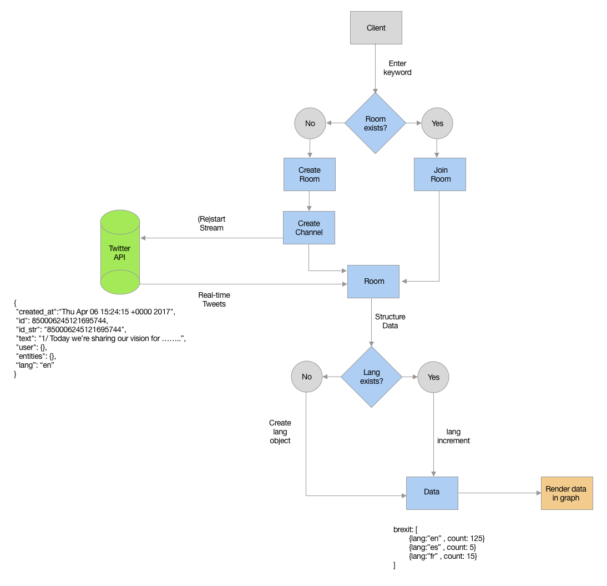

# Real time web
For this course i've made an app which real-time visualises the languages used in tweets about the subject a user searched.

## Demo
[Demo](https://twitlang.herokuapp.com/)|[Repo](https://github.com/dorusth/real-time-web-1819)


## table of contents
- [Installation](#Installation)
- [Concept](#Concept)
- [API](#API)

## Installation
This project works with: node, express, socket.io and compression.
Clone the repo with:
```bash
$ git clone https://github.com/dorusth/real-time-web-1819.git
```
to use the app use
```bash
$ cd real-time-web-1819/week-2-3
$ npm install
$ npm start / $ npm run dev
```
and open "http://localhost:3000/"

## Concept
My concept is a visualisation on popularity on twitter.
In my site users can enter a keyword/hashtag and it will return the tweets plotted in a [Chartist](http://gionkunz.github.io/chartist-js/) graph based on the languages used in the tweets.
The data is based on the data from the Twitter real-time API


## API
The API I will be using is the twitter API.
Twitter uses a key that is linked to your twitter account and it has a [rate limit](https://developer.twitter.com/en/docs/ads/general/guides/rate-limiting.html) on 15 minute blocks.
For requesting the data i'm using [twitter-stream-channels](https://www.npmjs.com/package/twitter-stream-channels) to let multiple users have different streams of data for different keywords.

## Data lifecycle


[MIT](LICENCE) © [Dorus ten Haaf](https://dorustenhaaf.com)
